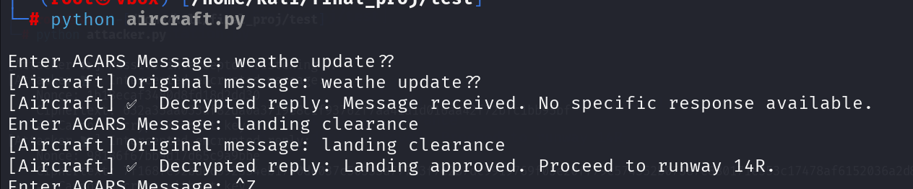
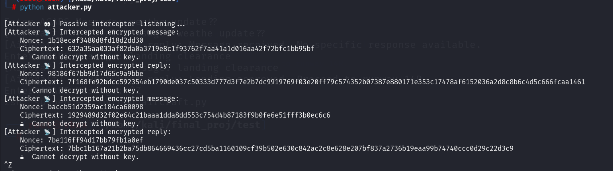
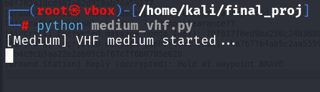

# 🛫 ACARS Communication Simulation with Encryption

This project simulates an encrypted communication system between an Aircraft and a Ground Station using the ACARS protocol. It includes a simulated VHF medium, optional attacker eavesdropping, and both GUI and CLI interfaces for the aircraft.

---

## 📌 Features

- ✈️ Aircraft sends encrypted ACARS messages (via terminal or GUI)
- 📡 VHF medium simulates noise, delay, and message loss
- 🛰️ Ground Station replies with command/control messages
- 🕵️ Passive Attacker intercepts messages but cannot decrypt them
- 🔐 ChaCha20 encryption ensures message confidentiality

---

## 🧱 Project Structure

```bash
.
├── aircraft.py             # CLI for aircraft communication
├── aircraft_ui.py          # Tkinter GUI for aircraft
├── attacker.py             # Passive message interceptor
├── ground_station.py       # Receives, decrypts, and replies to messages
├── medium_vhf.py           # Simulates VHF transmission with noise/delay
├── crypto_utils.py         # ChaCha20 encryption/decryption logic (required)
├── config.py               # Constants (e.g., ports, speed of light, etc.)
├── *.png                   # Screenshots and interface images
```

---

## 💻 Screenshots

| Aircraft Console | Aircraft GUI |
|------------------|--------------|
|  |  |

| Attacker | Ground Station | Medium |
|----------|----------------|--------|
|  |  |  |

---

## 🔧 Requirements

- Python 3.7+
- Required packages:
  ```bash
  pip install pyzmq cryptography
  ```

---

## 🚀 Running the Simulation

> Run each of the following in a **separate terminal window** (in this order):

### 1. Ground Station
```bash
python ground_station.py
```

### 2. Medium (VHF)
```bash
python medium_vhf.py
```

### 3. Attacker (Optional)
```bash
python attacker.py
```

### 4. Aircraft (choose one)

#### Terminal interface:
```bash
python aircraft.py
```

#### GUI interface:
```bash
python aircraft_ui.py
```

---

## 🔐 Encryption Details

The system uses the **ChaCha20** stream cipher for encryption and decryption, via:

```python
encrypt_message(plaintext)  # returns (nonce, ciphertext)
decrypt_message(nonce, ciphertext)  # returns plaintext
```

These are expected to be defined in `crypto_utils.py`.

---

## ⚙️ Configuration

Ensure you have a `config.py` file defining constants like:

```python
AIRCRAFT_TO_MEDIUM_PORT = 5555
MEDIUM_TO_GROUND_PORT = 5556
GROUND_TO_MEDIUM_PORT = 5557
MEDIUM_TO_AIRCRAFT_PORT = 5558
SPEED_OF_LIGHT = 300_000_000  # meters/sec
MESSAGE_LOSS_PROB = 0.1       # 10% chance
```

---

## 🧪 Simulation Logic Highlights

- Noise is introduced based on signal quality (degrades with distance)
- Propagation delay is calculated using real-world physics
- Message loss is probabilistic
- The attacker can only intercept but **not decrypt** due to secure encryption

---

## 📚 Educational Purpose

This project is built to **demonstrate secure message exchange** in aviation systems, and show how encryption protects against eavesdropping even over an insecure medium.

---

## 🛠️ Made With

- [Python](https://www.python.org/)
- [ZeroMQ (pyzmq)](https://zeromq.org/)
- [cryptography](https://cryptography.io/)

---

## 👩‍💻 Author

**Sreshta Chelumala**  
B.Tech Cybersecurity, VNR VJIET  
GitHub: [@sreshtachelumala](https://github.com/sreshtachelumala)

---

> “Strong encryption, weak channel, zero compromise.” 🔒

